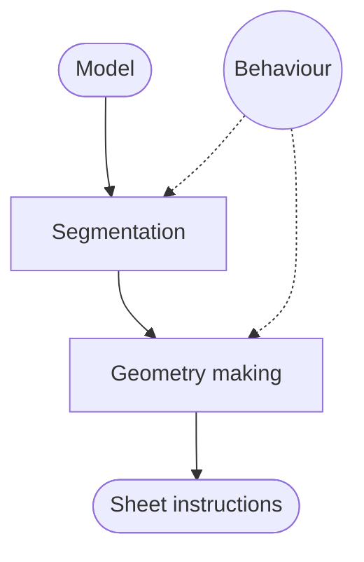

# Introduction
This is the component library for sheet cutting.

# Structure
The lilbrary is structured into the following parts

The main modules are Segmentation and the Geometry making. Segmentation converts the input model into segments that can be further processed. Geometry making is not currently implemented, but will be responsible for producing geometry that is fit for sheet cutting. Some examples of geometry making's responsibility is lattice hinges, integral joints, locking mechanism, etc...

Segmentation and geometry making is configured by using behaviors. Behaviors are small functionalitites that act as filters, constraints and requirements on different parts of the segmentation and geometry pipeline. Behaviours represents a family of different subtypes. Currently the following behaviour types are available
- Polygon selectors
	- Polygon selectors are used to score polygons in a sheet. They can be used to select the initial polygon in segment creation. When multiple polygon selectors are in use. The average value is used as the final score.
- Edge filtes
	- Edge filters are, as the name suggest, used to filter out which edges are applicable for use. This is used by one of the segment builders to select wich edges can be used to build hinges. Multiple edge filters are combined with the AND operator. 
- Segment constraints
	- Segment constraints are used to determine if a polygon can be added to a segment.
		- Some examples of segment constraints are dimensions, aspect ratio and self intersections

# Demonstration

For demonstrating purposes, the following mesh will be used:
![[Pasted image 20250120192738.png]]

# ReactiveSegmentationBuilder

The ReactiveSegmentationBuilder is a greedy algorithm that will do a "best-fit" approach to build segments. Each segment will be expanded until they are limited by the constraints specified. This can lead to unbalanced segments where some might consist of 90% of the polygons, with a few small segments to fill the gaps. The component requires at least one behaviour to function. Given a uselsess component(Nickname is MinEdgeLength). The component produces the following segment
![[Pasted image 20250120194214.png]]
Here you can see one large segment(red).
![[Pasted image 20250120194421.png]]
The unfolded mesh looks like this
![[Pasted image 20250120194714.png]]
Somewhat usesless. Lets fix it

## SegmentConstaints
### SegmentIntersectionConstraint
SegmentIntersectionConstraint is responsible for preventing self intersecting segments from being formed. It checks that the unfolded representation of the segment is free from overlapping polygongs.
With the above mesh and the following grasshopper config:
![[Pasted image 20250120194951.png]]
8 segments are produced with the following shapes
1. ![[Pasted image 20250120195130.png]]
2. ![[Pasted image 20250120195202.png]]
3. ![[Pasted image 20250120195218.png]]
4. ![[Pasted image 20250120195456.png]]

The remaining sections are similar to 3 with few   with few polygons. The resulting segmentated mesh looks like this
![[Pasted image 20250120195420.png]]
The first segment is still the largest due to the "best-fit" approach. But now it's possible to produce every segment without overlaps.

### SegmentDimensionConstraint
The SegmentDimensionConstraint locks the maximum size of the segments. This can be used to ensure that each segment can fit within a given boundary, e.g. a A4 sheet of paper.'
Given the above grasshopper script with the dimension constraint set to an A4 sheet
![[Pasted image 20250120200121.png]]
9 segments are produced with the following mesh:
![[Pasted image 20250120200212.png]]
Segment 1 (red) is still large, but another section is of equal size. This is due to the constraint preventing the segment from expanding beyond our requirements.
The red segment now looks like this
![[Pasted image 20250120200358.png]]
As you can see, the segment perfectly fits into a sheet of paper.

### SegmentAspectRatioConstraint
SegmentAspectRatioConstraint tries to keep the aspect ratio of the segment within a specified treshold. For example it can be 2x1, 3x4, 1x1, etc.
The component has 3 inputs
- aspect ratio
	- This is the target aspect ratio of the segment, calculated as w/h
- variation
	- This is how much the aspect ratio can vary in the segment, variation is +- the target aspect ratio
- activation treshold
	- This is an unsigned value indicating when the constraint should take full effect. The treshold is applied as `min((number of polygons)/(activation treshold), 1)` meaning that the treshold will increase in strength as the segment grows. The reason this input is provided is due to small segments having bad aspect ratio. This input then allows the segment to reach an desireable size before applying the aspect ratio check.

# TO COME
## Geometry
will come a component with logic from the old version of the unwrapper

## Voronoi
a simple 3d voroni model intersection for constraints

## Paintbrush
shall draw up idea on paper.